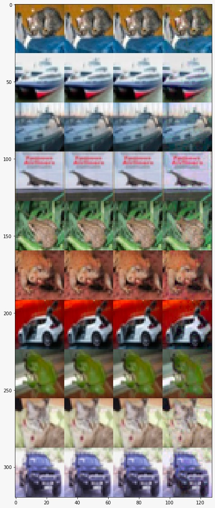
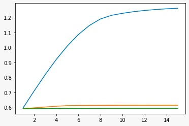
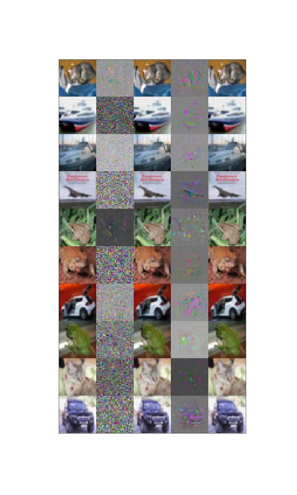
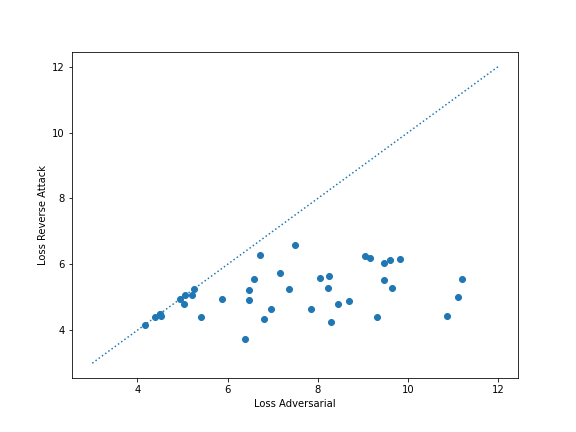

# Practical Deep Learning System Performance Final Project

Team member:  
1. kh3120 Kuanyao Huang
2. sm5116 Sujith Reddy Mammidi

## Project description

Machine learning robustness is now a popular topic in computer vision. In this project, we combine two 
techniques: **self-supervised learning**(SSL) and **contrastive loss** to improve model's performance on corrupted 
datasets at **inference time**.

We reimplemented the paper *Adversarial Attacks are Reversible with Natural Supervision* by Chengzhi Mao et al. 
The basic idea is that adversarial attack can greatly decrease the mutual information between the input data and
the label. In addition, an increase in contrastive loss between augmentations of the same image is observed due 
to the adversarial attack. The author proposed that if we can "correct" the image through self-supervised learning,
then we can prove the mutual information between the image and label improves and hence leads to a better performance.

The advantage of this method is that we don't have to retrain the clean classifier, we correct the image at test time
instead. The main drawback of this method is it takes more time to perform inference. 

Our project can be divided into several part:
1. Train the clean classifier
2. Prepare the adversarial dataset
3. Perform self-supervised learning to train the self-supervised learning head
4. Visualization for attack/counter attack images
5. Show the contrastive loss for attacked images and repaired images
6. Perform inference on the adversarial dataset
7. Discussion


----------------------------
# Implementation Details

## Part 1: Train the clean classifier
Train the clean classifier using wide-resnet34  
The weight can be downloaded by

```
mkdir weight
cd weight/
wget https://cv.cs.columbia.edu/mcz/ICCVRevAttack/cifar10_rst_adv.pt.ckpt
```

## Part 2: Create adversarial dataset
We adopt projected gradient descent to generate the adversarial attacks on test images and 
store them in a temporary folder `./data/pgd/`
```
python3 src/attack.py --attack_iters 5 --norm l_1
python3 src/attack.py --attack_iters 5 --norm l_2
python3 src/attack.py --attack_iters 5 --norm l_inf
```
or
```
python3 src/attack.py --attack_iters 5 --norm all
```
You can specify number of iterations for pgd attack.

### Creating adversarial test datasets using pgd and Visualization

We use the adversarial strength epsilon = 8 to perturbe the images, the images are shown from iteration=0, 5, 10 and 15 from left to right.  



We can see the perturbation is invisible to human eyes

The test loss for the attack as a function of perturbation iteration is shown below:



The blue curve is for L-infinity, orange one L2, green one L1. 

## Part 3: Train Self-Supervised Head
Command:
```
python3 train.py --task SSL
```

## Part 4: Inference without SSL:
```
python3 inference.py --norm clean
python3 inference.py --norm l_1
python3 inference.py --norm l_2
python3 inference.py --norm l_inf
```

Result: 
| Perturbation | Accuracy (%) | Test Loss |
|--------------|--------------|-----------|
| Clean        | 89.69        | 0.5263    |
| L1           | 89.64        | 0.5272    |
| L2           | 88.71        | 0.5441    |
| Linf         | 74.08        | 0.8110    |

## Part 5: Visualize reverse attack vector



The arrangement of the figure is as described: origianl image --> normalized adversarial attack noise --> attacked image --> normalized reverse attack vector --> recovered image.

The above graph shows while projected gradient descent can attack on some crucial parts such as eyes and contours, the reverse attack vector is trying to repair the image by adding some information especailly on these crucial portion.

## Part 6: Contrastive loss distribution before and after the attack



The x-axis of the figure shows the distribution of contrastive loss of a batch of images with adversarial attacks. The y values are the corresponding loss for the batch of images with counter-attacks. We can see that the contrastive loss is always improving as we perform the counter-attack.

## Part 6: Inference with SSL
```
python3 inference.py --task SSL --norm clean
python3 inference.py --task SSL --norm l_1
python3 inference.py --task SSL --norm l_2
python3 inference.py --task SSL --norm l_inf
```
or
```
./run_all.sh
```

### Attack 5 epochs+ counter attack 5 epochs 
| Perturbation | Baseline Accuracy (%) | Baseline Test Loss | Accuracy(%) | Test Loss |
|--------------|--------------|-----------|--------------------|------------------|
| L1           | 89.64        | 0.5272    | 89.64              | 0.5272           |
| L2           | 88.71        | 0.5441    | 88.70              | 0.5441           |
| Linf         | 74.08        | 0.8110    | 73.94              | 0.8148           |

### Attack 10 epochs + counter attack 5 epochs
| Perturbation | Baseline Accuracy (%) | Baseline Test Loss | Robust Accuracy(%) | Robust Test Loss |
|--------------|--------------|-----------|--------------------|------------------|
| L1           | 89.58        | 0.5280    | 89.59              | 0.5280           |
| L2           | 87.74        | 0.5606    | 87.73              | 0.5605           |
| Linf         | 70.23        | 0.8850    | 70.17              | 0.8885           |

### Attack 15 epochs + counter attack 5 epochs
| Perturbation | Baseline Accuracy (%) | Baseline Test Loss | Robust Accuracy(%) | Robust Test Loss |
|--------------|--------------|-----------|--------------------|------------------|
| L1           | 89.54        | 0.5288    | 89.54              | 0.5288           |
| L2           | 86.89        | 0.5781    | 86.89              | 0.5780           |
| Linf         | 70.20        | 0.8888    | 69.96              | 0.8921           |

------------------------------
## Discussion

The adversarial attack can degrade the performance of the model without being detected by humans eyes. 
However, the author found the contrastive loss of the corrupted images are worse than the clean one and hence 
repairing the image by contrastive learning may help to enhance the performance of the original task. 

We observe the image after the attack doesn't really look different from the original image.  


------------------------------
Using different loss function   

`TODO: should provide a graph`  

Using different batch size(i.e. number of negative example)  

`TODO: should provide a graph`  

------------------------------
## Reference materials:
1. Adversarial Attacks are Reversible with Natural Supervision: https://arxiv.org/abs/2103.14222
2. A Simple Framework for Contrastive Learning of Visual Representations: https://arxiv.org/abs/2002.05709
