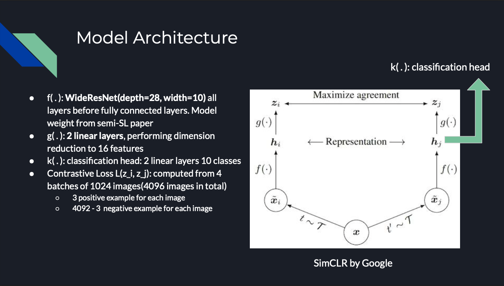
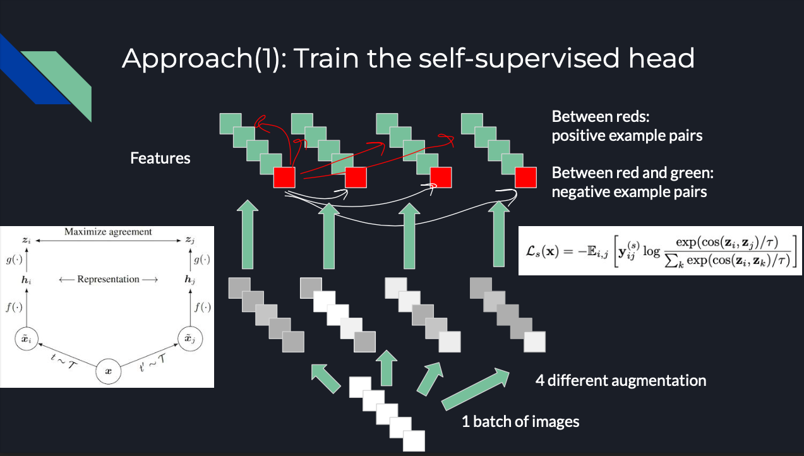
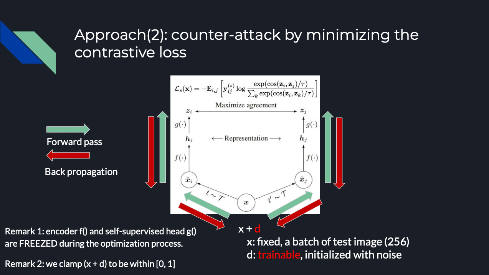

# Practical Deep Learning System Performance Final Project

Team member:  
1. kh3120 Kuanyao Huang
2. sm5116 Sujith Reddy Mamidi

## Project description

Machine learning robustness is now a popular topic in computer vision. In this project, we combine two 
techniques: **self-supervised learning**(SSL) and **contrastive loss** to improve model's performance on corrupted 
datasets at **inference time**.

We follow the concept from the paper *Adversarial Attacks are Reversible with Natural Supervision* by Chengzhi Mao et al and 
to implement the self-supervised reverse attack from scratch. 
The basic idea is that adversarial attack can greatly corrupt the mutual information between the similar input image pairs. 
In addition, an increase in contrastive loss between augmentations of the same image is observed due to the adversarial attack. 
The author proposed that "correcting" the image through self-supervised learning can resume the mutual information between 
the image and label and hence leads to a better performance.

The advantages of this method are 
1. we don't have to retrain the clean classifier, we correct the image at test time instead.
2. The method can be combined with all the other CNN-based counter-attack methods.  
3. It works as long as the corruption violates constraints of natural manifolds.


Our project can be divided into several part:
1. Train the clean classifier
2. Prepare the adversarial dataset
3. Perform self-supervised learning to train the self-supervised learning head
4. Visualization for attack/counter attack images
5. Show the contrastive loss for attacked images and repaired images
6. Perform inference on the adversarial dataset
7. Discussion

## Model Architecture And Training Pipeline


We use the SimCLR architecture as the backbone of the self-supervised correction. We add another head for performing classification.


We modify the backbone of the SimCLR pipeline by having more augmentations(4). You can even increase the number of branches by the flag
`--n_views 4`. We do so since we want to provide more positive and negative examples.


We minimize the contrastive loss by the added noise tensoer d at test time and return the corrected image x+d. Then we use the repaired
image to perform inference without modifying any weights of the model.

----------------------------
# Implementation Details

## Part 0: System details:

We train our model with four v4 CPU, one T4 GPU on Google cloud platform with PyTorch 1.11 images. We train our self-supervised head for 50 epochs 
with Adam optimizer and a learning rate of 0.0001. We use multistep scheduler to decrease the learning rate by 10 at 25 and 37 epochs 
respectively. 

We use CIFAR10 test dataset as the source dataset and using the projected gradient descent to corrupt the dataset with different norm 
(l1, l2, linf) and attack budgets (i.e. attack for 5, 10, 15, 50 iterations). 

At inference time, we evaluate the performance of the model using the above corrupted dataset with a counter attack budget of 5 iterations
per batch of images. 

## Part 1: Train the clean classifier
Train the clean classifier using wide-resnet34  
The weight can be obtained by

```
mkdir weight
cd weight/
wget https://cv.cs.columbia.edu/mcz/ICCVRevAttack/cifar10_rst_adv.pt.ckpt
```
This is the weight of a state-of-the-art counter-attack model from the paper *Are labels required for improving adversarial robustness?*.

## Part 2: Create adversarial dataset
We use projected gradient descent(PGD) as our default attack method to generate the adversarial attacks on test images and 
store them in a temporary folder `./data/pgd/`
```
python3 src/attack.py --attack_iters 5 --norm l_1
python3 src/attack.py --attack_iters 5 --norm l_2
python3 src/attack.py --attack_iters 5 --norm l_inf
```
or
```
python3 src/attack.py --attack_iters 5 --norm all
```
You can specify number of iterations for PGD attack.

### Creating adversarial test datasets using pgd and Visualization

We choose an adversarial strength epsilon = 8/255 to perturbe the images with L-infinity norm, epsilon=256/255 for L-2 norm. The corrupted images are shown from iteration=0, 5, 10 and 15 from left to right.


The perturbation is nearly imperceptible to human eyes

The test loss for the attack as a function of perturbation iteration is shown below:


The blue curve is for L-infinity, orange one L2, green one L1. 

## Part 3: Train Self-Supervised Head
We use the encoder part of wideresnet28 and the self-supervised head to tain on contrastive learning task. The weight for the 
encoder is fixed because there is another downstream task(classification) afther the encoder.

Command:
```
python3 train.py --task SSL
```

## Part 4: Inference without SSL:
```
python3 inference.py --norm clean
python3 inference.py --norm l_1
python3 inference.py --norm l_2
python3 inference.py --norm l_inf
```

Result: 
| Perturbation | Accuracy (%) | Test Loss |
|--------------|--------------|-----------|
| Clean        | 89.69        | 0.5263    |
| L1           | 89.64        | 0.5272    |
| L2           | 88.71        | 0.5441    |
| Linf         | 74.08        | 0.8110    |

## Part 5: Visualize reverse attack vector


The arrangement of the figure is as described: origianl image --> normalized adversarial attack noise --> attacked image --> normalized reverse attack vector --> recovered image.

The above graph shows while projected gradient descent can attack on some crucial parts such as eyes and contours, the reverse attack vector is trying to repair the image by adding some information especailly on these crucial portion.

## Part 6: Contrastive loss distribution before and after the attack


The x-axis of the figure shows the distribution of contrastive loss of batches of test images without correction. The y values are the corresponding loss for thosse with counter-attacks. We note that the contrastive loss is always improving as we perform the counter-attack.

## Part 6: Inference with SSL
```
python3 inference.py --task SSL --norm clean
python3 inference.py --task SSL --norm l_1
python3 inference.py --task SSL --norm l_2
python3 inference.py --task SSL --norm l_inf
```
or
```
./run_all.sh
```

The following baseline accuracy means we use the default state-of-the-art Semi-SL weight to perform inference and 
the robust accuracy means we correct the image throught natural supervision and use the Semi-SL model to perform inference.

### Attack 5 epochs+ counter attack 5 epochs 
| Perturbation | Baseline Accuracy (%) | Baseline Test Loss | Robust Accuracy(%) | Robust Test Loss |
|--------------|--------------|-----------|--------------------|------------------|
| L1           | 89.64        | 0.5272    | 89.64              | 0.5272           |
| L2           | 88.71        | 0.5441    | 88.70              | 0.5441           |
| Linf         | 74.08        | 0.8110    | 74.94              | 0.8048           |

### Attack 10 epochs + counter attack 5 epochs
| Perturbation | Baseline Accuracy (%) | Baseline Test Loss | Robust Accuracy(%) | Robust Test Loss |
|--------------|--------------|-----------|--------------------|------------------|
| L1           | 89.58        | 0.5280    | 89.59              | 0.5280           |
| L2           | 87.74        | 0.5606    | 87.73              | 0.5605           |
| Linf         | 70.23        | 0.8850    | 71.17              | 0.8725           |

### Attack 15 epochs + counter attack 5 epochs
| Perturbation | Baseline Accuracy (%) | Baseline Test Loss | Robust Accuracy(%) | Robust Test Loss |
|--------------|--------------|-----------|--------------------|------------------|
| L1           | 89.54        | 0.5288    | 89.54              | 0.5288           |
| L2           | 86.89        | 0.5781    | 86.89              | 0.5780           |
| Linf         | 70.20        | 0.8888    | 70.96              | 0.8821           |

### Attack 50 epochs + counter attack 5 epochs
| Perturbation | Baseline Accuracy (%) | Baseline Test Loss | Robust Accuracy(%) | Robust Test Loss |
|--------------|--------------|-----------|--------------------|------------------|
| L2           | 86.89        | 0.5781    | 86.89              | 0.5780           |
| Linf         | 70.25        | 0.8873    | 70.07              | 0.8909           |

------------------------------
## Discussion

The adversarial attack can degrade the performance of the model without being detected by humans eyes. 
However, the author of the paper found the contrastive loss of the corrupted images are worse than the clean one and hence 
repairing the image by contrastive learning may help to enhance the performance of the original task. 

We utilized the SimCLR architecture with 4 different augmentations to perform contrastive learning and restored the intrinsic structure
of the data at inference time. The result shows improvements in some of the corrupted dataset. With a different perturbation budget,
the gain from this method may vary but this method usually yields at a comparable performance. 

We tried many different hyperparameters to evaluate the effectiveness of this method, including changing perturbation scale epsilon/the 
iterations of projected gradient descent/the iteration of self-supervised repair. I would say tackling the adversarial attack is never 
an easy task. We failed for many times and found many tricky details in the implementation part. The main obstacles in this project is 

1. to find an appropriate augmentation type(e.g. Gaussian blur usually degrades the performance),
2. to adopt an memory-efficient contrastive learning pipeline to train the model with few resources,
3. to provide a great variety of negative examples in comparison with position examples,
4. to use the correct normalization methods(the baseline model provided by Semi-SL paper is not trained with resnet preprocessing), and
5. to finetune the appropriate attack and counter-attack budget.

If one does not paying attention to any of the above point, the performance is unlikely to improve.

### Advanage
Even though the model is not easy to train, this method still provide some benefits. Firstly, the model can be combined with a variety of 
the state-of-the-art counterattack methods(e.g. Semi-SL, robust overfit, BAG, MART...). The only thins we have to modify is the backbone 
structure. In addition, the self-supervised head is light-weighted, consisting of only two linear layers, which is easy to train. Finally, 
the method is performed at inference time, meaning we don't have to retrain the model when we encounter any new test domains.

### Disadvantage
We noticed that the inference time is usually 40x more than not using the self-supervised correction if we pick a defense budget of 5 iteration.
It is due to the complexity to compute the gradient and find a noise to minimize contrastive loss. In addition, the improvement we obtained is 
mostly slightly better and not as remarkable as the author claimed. If the task requires a limited inference budget, then other counter-attack
methods are more favorable than this one.

------------------------------
## Reference materials:
1. Adversarial Attacks are Reversible with Natural Supervision: https://arxiv.org/abs/2103.14222
2. A Simple Framework for Contrastive Learning of Visual Representations: https://arxiv.org/abs/2002.05709
3. Are labels required for improving adversarial robustness? https://arxiv.org/abs/1905.13725
4. Overfitting in adversarially robust deep learning https://arxiv.org/pdf/2002.11569.pdf
5. BAG OF TRICKS FOR ADVERSARIAL TRAININ https://arxiv.org/pdf/2010.00467.pdf
6. IMPROVING ADVERSARIAL ROBUSTNESS REQUIRES REVISITING MISCLASSIFIED EXAMPLES https://openreview.net/pdf?id=rklOg6EFwS
